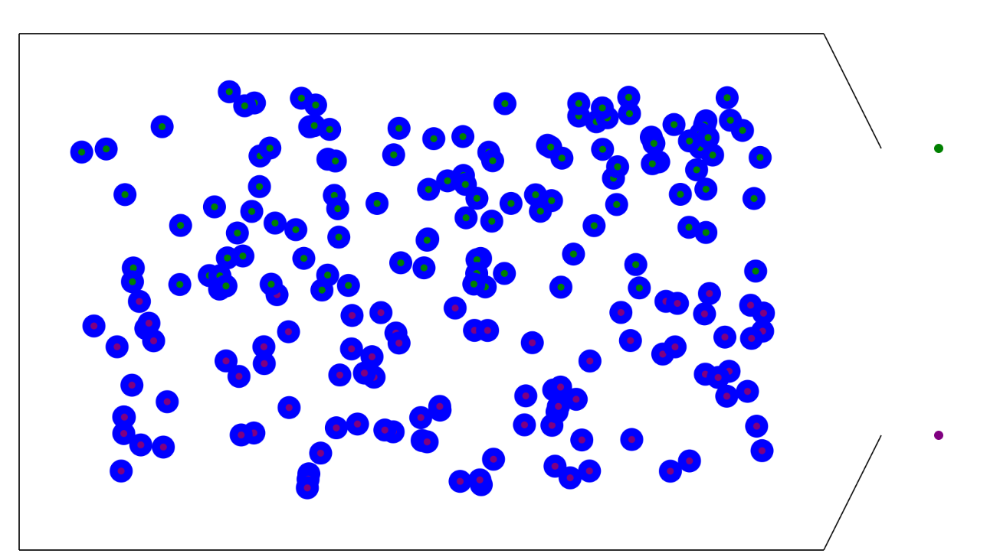

# PHOTOSENSITIVITY WARNING: This model contains behavior resulting in flashing lights. Beware if you suffer from epilepsy.

# Contractile Particle Model (CPM)
This directory contains the CPM model as described in the paper "Continuous-space automaton model for pedestrian dynamics" by Gabriel Baglietto and Daniel R. Parisi.
The model is made with javascript in order to facilitiate easy visualizations with HTML, without requiring the installation of any additional software.
To run the simulation, simply open the `simulation.html` file in your web browser (only tested on Microsoft Edge) and click the start button.

One addition to the model is that the particles dynamically compute their desired target based on the Euclidean distance to the targets, choosing the nearest one. 
If there is only 1 target, the model is equivalent to the model as described in the paper.
Another addition is the removal of particles that reached the target, though this is more of a quality of life update and does not affect the general model behavior.

The model essentially works as in the `simulation_loop.png`, where we first find contacts between particles, then adjust the radii accordingly, compute the corresponding velocities,
update their position, then remove the particles that reach the target, and continually iterate through this until all particles have reached the targets.

