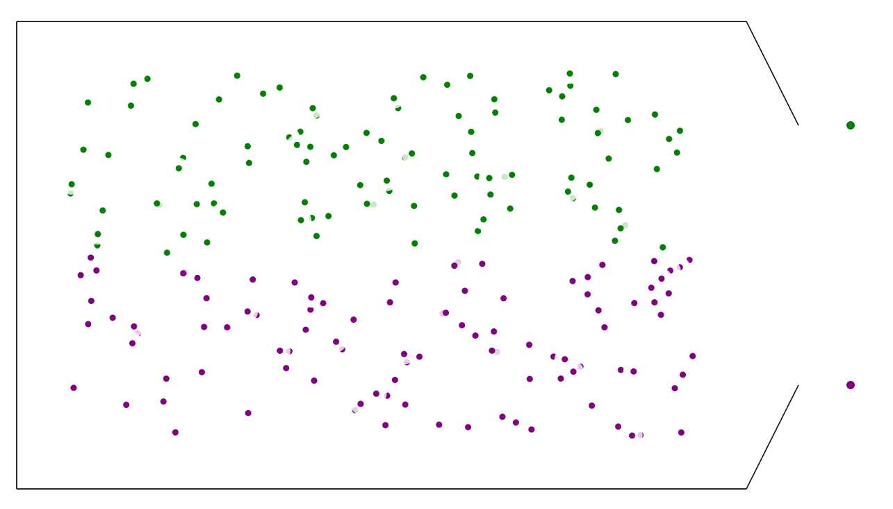
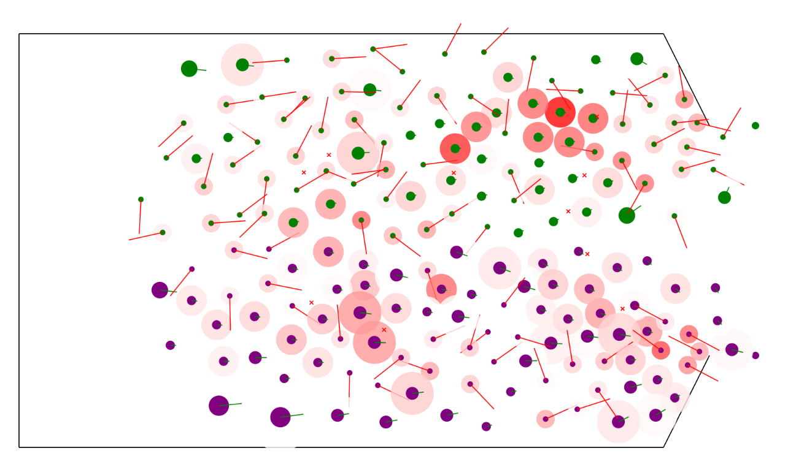

# Modification 2: Death with Death Markers
We have added a death mechanism, which allows particles to die when they are essentially crushed by the surrounding particles.
This is made to mimic similar behavior in real-life scenarios, where individuals die either of trampling, or as research suggests, due to asphixiation.

The model before starting the simulation can be seen below:

The model after running for a few seconds can be seen below:
