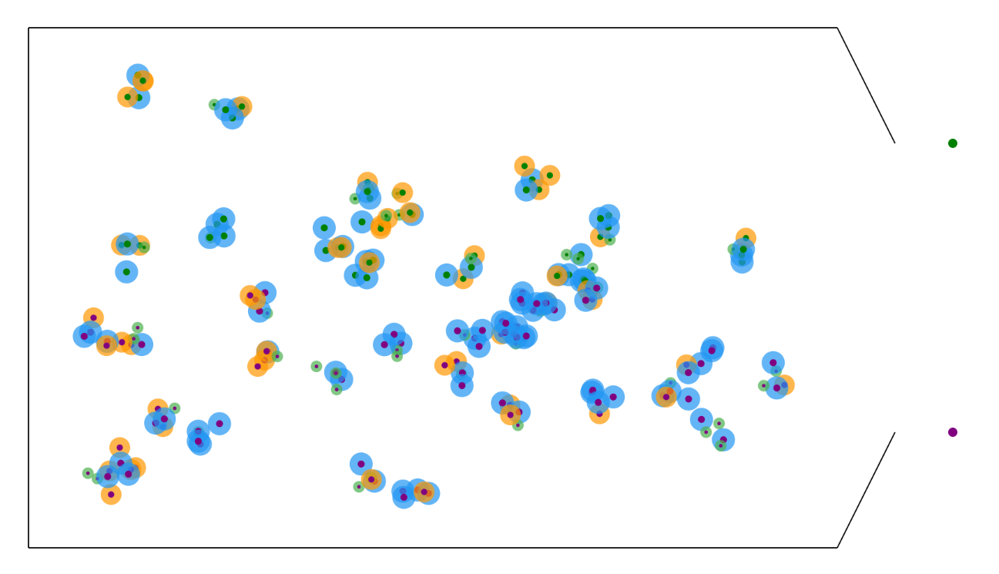
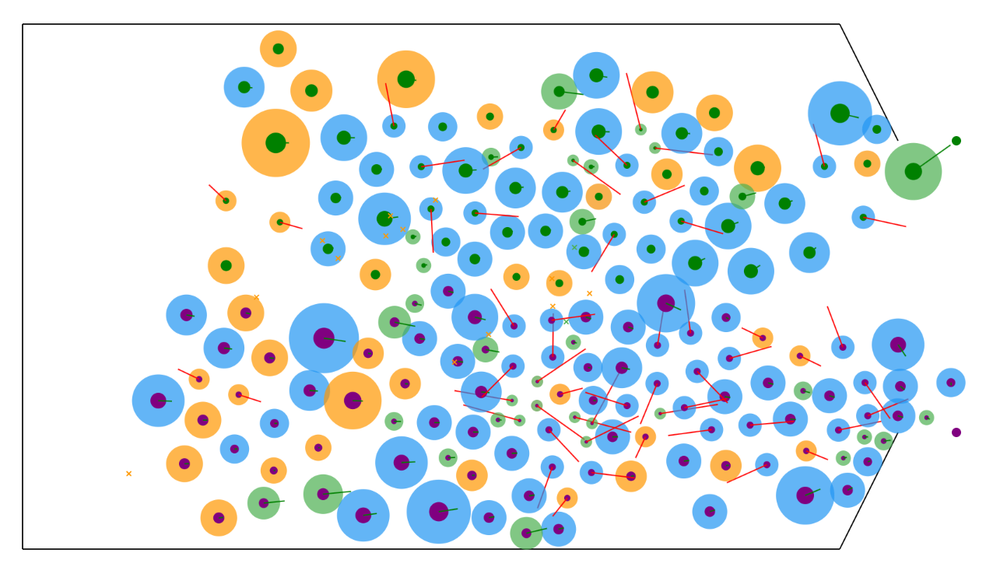

# Modification 3: Varying population
To model a more realistic population, we add particles that are initialized with different parameters.
This allows us to model more realistic demographics (old, adult, young), fast and slow individuals, smaller and larger individuals, weaker and stronger individuals etc...

The model before starting the simulation can be seen below:

The model after running for a few seconds can be seen below:
